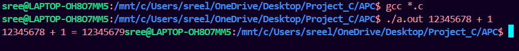
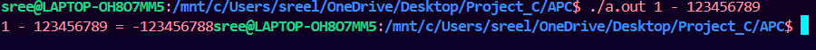
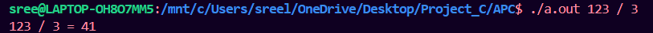

# 🧮 Arbitrary Precision Calculator 

A command-line calculator built in C to **perform arithmetic operations on very large numbers** using doubly linked lists — simulating manual digit-by-digit calculations.

---

## Table of Contents

- [Features](#features)
- [Prerequisites](#prerequisites)
- [Building](#building)
- [Usage](#usage)
  
- [How It Works](#how-it-works)
  - [Supported Operations](#supported-operations)
- [Project Structure](#project-structure)
- [Error Handling](#error-handling)
- [Output](#output)


---

## Features

- ➕ Supports addition, subtraction, multiplication, and division  
- 🔁 Works on numbers of any length (limited only by memory)  
- 🧠 Implements manual arithmetic logic using doubly linked lists  
- 🧮 Handles carry/borrow operations manually for accuracy  
- ✨ Fully command-line based interface for user input  

---

## Prerequisites

- GCC or any C compiler  
- Basic terminal usage  
- Familiarity with arithmetic operations  

---

## Building

```bash
gcc *.c 
```

---

## Usage

```bash
./a.out <operand1> <operator> <operand2>
```


---

## How It Works

- Stores each digit of large numbers in a **doubly linked list**
- Performs manual digit-by-digit computation:
  - Addition: LSB to MSB with carry
  - Subtraction: LSB to MSB with borrow
  - Multiplication: repeated addition and shifting
  - Division: long division-style repeated subtraction
- Allows accurate calculations without using `int`, `long`, or `float` for large values

---

## Supported Operations

- ➕ Arbitrary-precision addition
- ➖ Subtraction with borrow handling
- ✖️ Manual multiplication with shifting
- ➗ Division with quotient tracking


---

## Project Structure

```
.
├── main.c             # Entry point and menu
├── addition.c         # Logic for addition
├── subtraction.c      # Logic for subtraction
├── multiplication.c   # Logic for multiplication
├── division.c         # Logic for division
├── digit_to_list.c    # Convert string to digit list
├── common_fn.c        # Common helpers: reverse, display, memory
├── apc.h              # Header file with all structures/prototypes
├── a.out              # Compiled binary (optional)
```

---

## Error Handling

- ❌ Input validation (non-digit, empty input)
- ❌ Division by zero
- ❌ Memory allocation failures
- ✅ All errors reported with meaningful messages
- ✅ Graceful termination and memory cleanup

---

## Output

### ✅ Example Output







---

